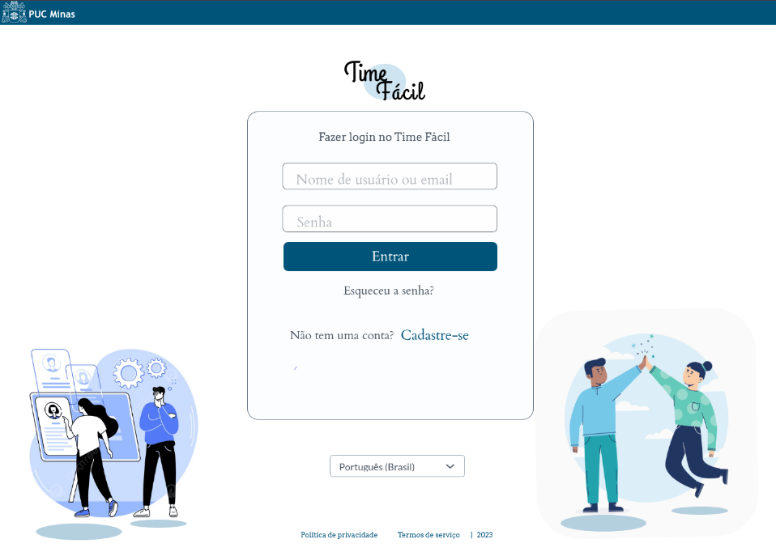

# Projeto de Interface

Pré-requisitos: <a href="2-Especificação do Projeto.md"> Documentação de Especificação</a>

Dentre as preocupações para a montagem da interface do sistema, estamos estabelecendo foco em questões como agilidade, acessibilidade e usabilidade. Desta forma, o projeto tem uma identidade visual padronizada em todas as telas que são projetadas para funcionamento em desktops e dispositivos móveis.

## User Flow
O diagrama apresentado na Figura X mostra o fluxo de interação do usuário pelas telas do sistema. Cada uma das telas deste fluxo é detalhada na seção de Wireframes que se segue. Detalhes do fluxo podem ser visualizados no https://marvelapp.com/project/6690976.

## Wireframes
Conforme fluxo de telas do projeto, apresentado no item anterior, as telas do sistema são apresentadas em detalhes nos itens que se seguem. As telas do sistema apresentam uma estrutura comum que é apresentada na Figura 2. Nesta estrutura, existem 3 grandes blocos, descritos a seguir. São eles:
- Cabeçalho - local onde são dispostos elementos fixos de identidade (logo) e imagem do usuário da aplicação;
- Conteúdo - apresenta o conteúdo da tela em questão;
- Barra lateral - apresenta os elementos de navegação que permite alternar entre os diferentes blocos de conteúdo.

Figura 3 - Estrutura padrão da aplicação

## Tela - Login
A tela de login permite o acesso de professores e alunos ao site. Com base na estrutura padrão, a tela de login fornece ao usuário, além dos campos para inserção de login e senha, a opção de trocar a senha, de se cadastrar e de mudar o idioma.

Figura 4 - Tela de login

## Tela – Criar Atividade
Permite ao professor criar uma atividade para uma disciplina que lecione. A atividade pode ter um tema livre (situação em que os alunos poderão formar grupos a partir de temas por eles sugeridos) ou tema fixo (caso em que os alunos apelas se organizarão em grupos a partir de critérios como horários sugeridos para os encontros ou afinidade pessoal). 

Figura 5 – Criar atividade

## Tela – Painel de Controle do Aluno
Tela inicial do aluno na aplicação, em que pode visualizar as atividades abertas nas disciplinas em que está matriculado.

Figura 6 – Painel de controle do aluno

## Tela – Criar Grupo
Apresenta ao aluno a possibilidade de criar um grupo numa disciplina em que esteja matriculado. A tela recupera as informações inseridas pelo professor por ocasião da criação da atividade: disciplina, nome da atividade, número mínimo e máximo de integrantes, prazo para fechamento dos grupos e tema (no caso de o tema ser fixo; se for aberto, é exibido ao aluno um campo para sugerir o tema a ser trabalhado). Ao aluno são apresentados campos para que sugira dias e horários para os encontros do grupo, além de um campo livre em que podem ser feito comentário ou observação.

Figura 7 – Criar grupo

  
## Tela – Grupos Abertos
Apresenta aos alunos matriculados em uma determinada disciplina a lista de grupos abertos em uma atividade criada pelo professor.

Figura 8 – Listar grupos

## Tela – Chat em grupo
Permite ao aluno e ao professor conversar a respeito do trabalho, do tema sugerido pelo aluno que criou o grupo (quando tiver sido o caso) e sobre os horários sugeridos para as reuniões. 

Figura 9 – Chat em grupo

## Tela – Entrar em grupo
Permite ao aluno ingressar em um grupo existente.

Figura 10 – Entrar em grupo

