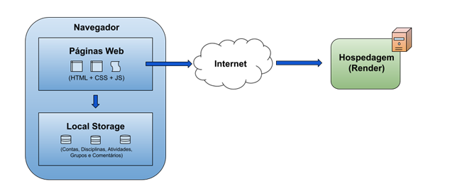

# Arquitetura da Solução

Nesta seção são apresentados os detalhes técnicos da solução criada pela equipe, tratando dos componentes que fazem parte da solução e do ambiente de hospedagem da solução.

## Diagrama de componentes

Os componentes que fazem parte da solução são apresentados na Figura que se segue.

Exemplo:

Os componentes que fazem parte da solução são apresentados na Figura XX.

Figura XX - Arquitetura da Solução

A solução implementada conta com os seguintes módulos:
- **Navegador** - Interface básica do sistema
  - **Páginas Web** - Conjunto de arquivos HTML, CSS, JavaScript e imagens que implementam as funcionalidades do sistema.
   - **Local Storage** - armazenamento mantido no Navegador, onde são implementados bancos de dados baseados em JSON. São eles:
     - **Contas** - os dados de acesso para as contas dos usuários, sejam eles alunos ou professores.
     - **Disciplinas** - Matérias criadas pelos professores.
     - **Atividades** - Atividades criadas pelos professores.
     - **Grupos** - Grupos criados pelos alunos e seus atributos, como membros, horário sugerido, dias da semana sugeridos, tema (se livre) e atividade relacionada.
     - **Comentários** - Comentários feitos pelos usuários nos grupos.
 - **Hospedagem** - local na Internet onde as páginas são mantidas e acessadas pelo navegador.

## Hospedagem

O site utiliza a plataforma do Render como ambiente de hospedagem do site do projeto. O site é mantido no ambiente da URL:

https://linkexemplo.render.com

A publicação do site no Render é feita automaticamente por meio de uma submissão do projeto (push) via git para o repositório remoto que se encontra no endereço do GitHub:

https://github.com/repo/link_exemplo.git