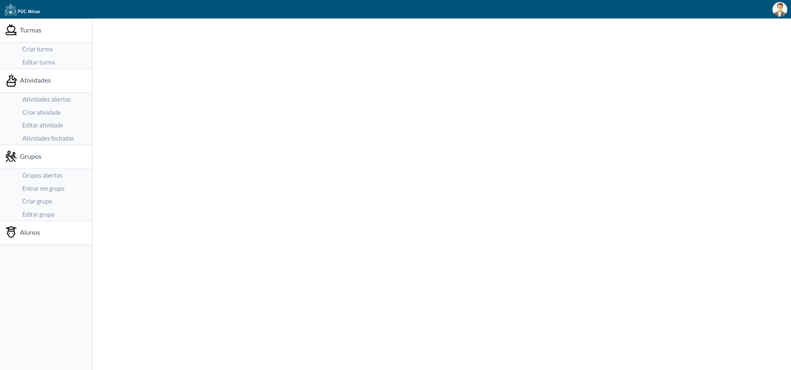

# Template padrão do site

O template padrão utilizado na a aplicação aprensenta, como previsto no projeto de interface, um cabeçalho, uma barra lateral à esquerda e uma área de conteúdo à direita. Foram utilizados ícones alusivos aos itens que estão no primeiro nível da barra lateral: turmas, atividades, grupo e alunos.

