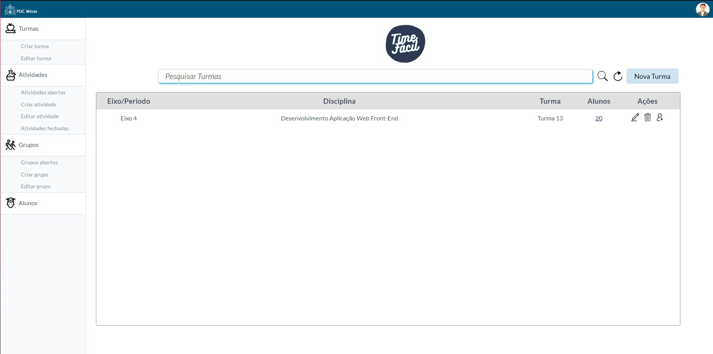
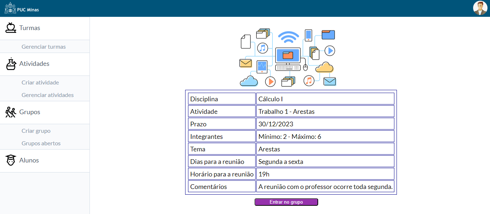

# Programação de Funcionalidades

### Gerenciar Turmas (RF-01)

A tela de gerencia de turma permite ao professor criar turmas, onde essas turmas terão informações como alunos: Disciplina Mestrada, Eixo/Periodo e Codigo de Turma. Nessa tela também permite que o professor excluia, alterar e adicionar aluno a uma turma. Através de uma tabela o professor conseguirá fazer o filtro de alguma turma para mais facil acesso, como também visualizar quantos membros e quais membros fazem parte daquela turma.

Artefatos da funcionalidade
- gerenciar-turma.html
- script.js
- main.css

Instruções de acesso

3. Faça o download do arquivo do projeto (ZIP) ou clone do projeto no GitHub;
4. Descompacte o arquivo em uma pasta específica;
5. Abra o Visual Studio Code e execute o Live Server;
6. Abra um navegador de Internet e informe a seguinte URL:
http://127.0.0.1:5500/src/gerenciar-turmas.html

### Criar Atividade (RF-02, RF-03, RF-04, RF-11)

Tela que permite ao professor criar uma nova atividade, definir se ela terá tema fixo, limitar a quantidade de membros que cada grupo relacionado àquela atividade terá e, também, definir a data limite de fechamento dos grupos.

Artefatos da funcionalidade
- criar-atividade.html
- script.js
- main.css

Instruções de acesso
1. Baixar os arquivos do projeto em https://github.com/ICEI-PUC-Minas-PMV-ADS/pmv-ads-2023-1-e1-proj-web-t13-g1-TimeFacil/archive/refs/heads/main.zip;
2. Descompactar o arquivo baixado;
3. No Microsoft Visual Studio Code, abrir a pasta que contém os arquivos baixados;
4. No Microsoft Visual Studio Code, abrir o arquivo index.html e executar a extensão Live Server ("Go Live");
5. Clicar no item de menu "Criar Atividade".

### Entrar em um grupo (RF-07)

A tela permite ao aluno entrar no grupo ao clicar no botão e retorna ao usuário uma caixa de confirmação em que ele pode confirmar ou cancelar a ação.

Artefatos da funcionalidade
- entrar_grupo.html
- script.js
- main.css
- foto-fundo.png

Instruções de acesso

3. Faça o download do arquivo do projeto (ZIP) ou clone do projeto no GitHub;
4. Descompacte o arquivo em uma pasta específica;
5. Abra o Visual Studio Code e execute o Live Server;
6. Abra um navegador de Internet e informe a seguinte URL:
http://127.0.0.1:5500/src/entrar_grupo.html

### Sair de um grupo (RF-08)

Após o aluno entrar no grupo, a tela permite que ele saia ao clicar no botão.

Artefatos da funcionalidade
- entrar_grupo.html
- script.js
- main.css
- foto-fundo.png

Instruções de acesso

3. Faça o download do arquivo do projeto (ZIP) ou clone do projeto no GitHub;
4. Descompacte o arquivo em uma pasta específica;
5. Abra o Visual Studio Code e execute o Live Server;
6. Abra um navegador de Internet e informe a seguinte URL:
http://127.0.0.1:5500/src/entrar_grupo.html

### Mostrar grupos (RF-10)

A tela exibe os cards dos grupos, ao clicar no botão o usuário pode obter mais informações sobre o grupo.

Artefatos da funcionalidade
- exibir_grupo.html
- script.js
- main.css

Instruções de acesso

3. Faça o download do arquivo do projeto (ZIP) ou clone do projeto no GitHub;
4. Descompacte o arquivo em uma pasta específica;
5. Abra o Visual Studio Code e execute o Live Server;
6. Abra um navegador de Internet e informe a seguinte URL:
http://127.0.0.1:5501/src/exibir_grupo.html
