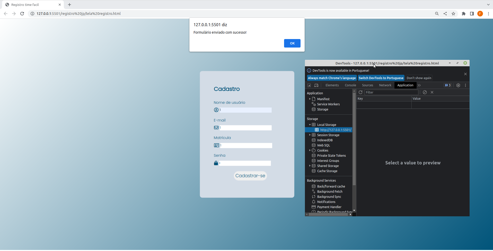
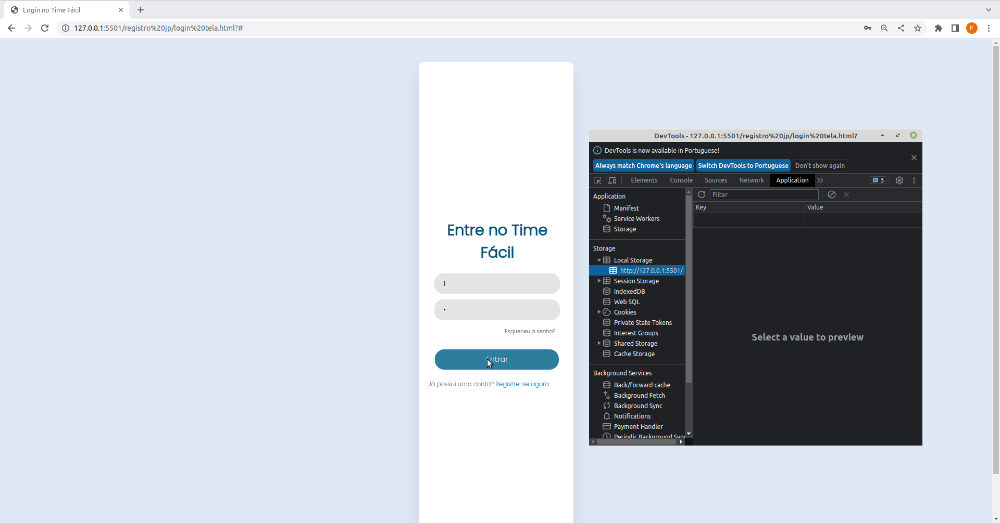
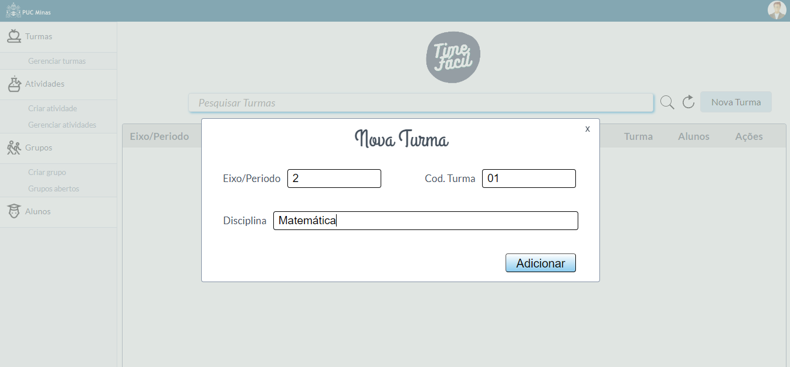

# Registro de Testes de Software

Pré-requisitos: <a href="3-Projeto de Interface.md"> Projeto de Interface</a>, <a href="8-Plano de Testes de Software.md"> Plano de Testes de Software</a>

Relatório com as evidências dos testes de software realizados no sistema pela equipe, baseado em um plano de testes pré-definido.

## Avaliação

Discorra sobre os resultados do teste. Ressaltando pontos fortes e fracos identificados na solução. Comente como o grupo pretende atacar esses pontos nas próximas iterações. Apresente as falhas detectadas e as melhorias geradas a partir dos resultados obtidos nos testes.

<!-- > **Links Úteis**:
> - [Ferramentas de Test para Java Script](https://geekflare.com/javascript-unit-testing/) -->

|Caso de Teste        | [CT-13] O site deve permitir o cadastro de professores e alunos.      |
|---------------------|-----------------------------------------------------------------------|
|	Requisito Associado | [RF-13] O site deve permitir o cadastro de professores e alunos.      |
| Objetivo do Teste 	 | Verificar se o cadastro dos usuários está sendo efetuado com sucesso.|
| Passos 	            | - Acessar a página Cadastro (tela registro.html)   - Preencher os campos "Nome de usuário", "E-mail", "Matrícula" e "Senha"   - Clicar no botão "Cadastrar-se" |
| Critério de Êxito   | Os dados informados por meio do formulário deverão ter sido armazenados com sucesso (em um arquivo JSON ou no LocalStorage). |
| Êxito?              | Não.                                                                  |
| Comentário          | Os dados informados durante o cadastro não estão sendo armazenados.   |
| Evidência           |  |

|Caso de Teste        | [CT-14] O site deve permitir o login dos usuários cadastrados.      |
|---------------------|---------------------------------------------------------------------|
|	Requisito Associado | [RF-14] O site deve permitir o login dos usuários cadastrados.      |
| Objetivo do Teste 	 | Verificar se o login dos usuários está sendo realizado com sucesso.|
| Passos 	            | - Acessar a página Entre no Time Fácil (login tela.html);   - Preencher os campos "Nome de usuário" e "Senha";   - Clicar no botão "Entrar". |
| Critério de Êxito   | O usuário deverá ter conseguido entrar no sistema.                  |
| Êxito?              | Não.                                                                |
| Comentário          | Após efetuar login, o usuário não entra no sistema.   |
| Evidência           |  |
|Caso de Teste        | [CT-05] O site deve permitir aos alunos criar seus grupos dentro das páginas de trabalhos dos professores, sendo possivel definir horarios para as reuniões.|
|---------------------|--------------------------------------------------------------------|
|	Requisito Associado | [RF-05] O site deve permitir aos alunos criar seus grupos dentro das páginas de trabalhos dos professores.   [RF-15]  O site deve permitir ao aluno, ao criar o grupo, a sugerir horários de reunião. |
| Objetivo do Teste 	| Verificar se o sistema está permitindo o cadastro de grupos com a definição de dias da semana e horario para as reuniões. |
| Passos 	            | - Acessar através do menu lateral a sessão de criar grupo (create_group .html);   - Preencher os campos pertinentes para a categoria de atividade criada pelo professor, juntamente com os dias propostos e/ou possiveis para as reuniões juntamente com os horarios;   - Caso necessario inserir algum comentario sobre a atividade proposta.   - Clicar no botão "Criar". |
| Critério de Êxito   | O usuario deve conseguir cadastrar uma atividade colocando dias e horarios como sugestão de reuniões, como  também a inserção de um comentario sobre a atividade proposta e os dados serem armazenados com sucesso (em um arquivo JSON ou no LocalStorage).|
| Exito?              | Sim                                                                 |
| Comentário          | Após a inserção de todos os dados pertinente o site solicitou que fosse salvo em um diretorio de sua maquina o Arquivo JSON referente a atividade criada.  |
| Evidência           |  |

|Caso de Teste        | [CT-01] O site deve permitir o gerenciamento de turmas.      |
|---------------------|-----------------------------------------------------------------------|
|	Requisito Associado | [RF-01] - O site deve permitir ao professor criar uma página para sua matéria.   |
| Objetivo do Teste 	 |  Verificar se o usuário consegue criar uma página para a sua matéria. |
| Passos 	            |  1) Acessar a página de gerenciar turmas, 2) Clicar em “Nova Turma”, 3) Informar nos campos indicados eixo/período, código da turma e disciplina, 4) Clicar em “Adicionar” |
| Critério de Êxito   | A matéria solicitada deve ser criada com as informações fornecidas pelo professor. As informações devem ser armazenadas no LocalStorage. |
| Êxito?              | Sim.                                                                  |
| Comentário          | Os dados informados durante o cadastro estão sendo armazenados e o professor consegue criar as turmas.   |
| Evidência           |  |

