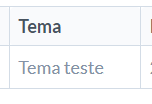

# Registro de Testes de Software

## Avaliação

|Caso de Teste        | [CT-01] O site deve permitir o gerenciamento de turmas.      |
|---------------------|-----------------------------------------------------------------------|
|	Requisito Associado | [RF-01] - O site deve permitir ao professor criar uma página para sua matéria.   |
| Objetivo do Teste 	 |  Verificar se o usuário consegue criar uma página para a sua matéria. |
| Passos 	            |  1) Acessar a página de gerenciar turmas, 2) Clicar em “Nova Turma”, 3) Informar nos campos indicados eixo/período, código da turma e disciplina, 4) Clicar em “Adicionar”. |
| Critério de Êxito   | A matéria solicitada deve ser criada com as informações fornecidas pelo professor. As informações devem ser armazenadas no LocalStorage. |
| Êxito?              | Sim.                                                                  |
| Comentário          | Os dados informados durante o cadastro estão sendo armazenados e o professor consegue criar as turmas.   |
| Evidência           |    |

|Caso de Teste        | [CT-05] O site deve permitir aos alunos criar seus grupos dentro das páginas de trabalhos dos professores, sendo possivel definir horarios para as reuniões.|
|---------------------|--------------------------------------------------------------------|
|	Requisito Associado | [RF-05] O site deve permitir aos alunos criar seus grupos dentro das páginas de trabalhos dos professores.   [RF-15]  O site deve permitir ao aluno, ao criar o grupo, a sugerir horários de reunião. |
| Objetivo do Teste 	| Verificar se o sistema está permitindo o cadastro de grupos com a definição de dias da semana e horario para as reuniões. |
| Passos 	            | - Acessar através do menu lateral a sessão de criar grupo (create_group .html);   - Preencher os campos pertinentes para a categoria de atividade criada pelo professor, juntamente com os dias propostos e/ou possiveis para as reuniões juntamente com os horarios;   - Caso necessario inserir algum comentario sobre a atividade proposta.   - Clicar no botão "Criar". |
| Critério de Êxito   | O usuario deve conseguir cadastrar uma atividade colocando dias e horarios como sugestão de reuniões, como  também a inserção de um comentario sobre a atividade proposta e os dados serem armazenados com sucesso (em um arquivo JSON ou no LocalStorage).|
| Exito?              | Sim                                                                 |
| Comentário          | Após a inserção de todos os dados pertinente o site solicitou que fosse salvo em um diretorio de sua maquina o Arquivo JSON referente a atividade criada.  |
| Evidência           |  |

|Caso de Teste        | [CT-13] O site deve permitir o cadastro de professores e alunos.      |
|---------------------|-----------------------------------------------------------------------|
|	Requisito Associado | [RF-13] O site deve permitir o cadastro de professores e alunos.      |
| Objetivo do Teste 	 | Verificar se o cadastro dos usuários está sendo efetuado com sucesso.|
| Passos 	            | - Acessar a página Cadastro (tela registro.html)   - Preencher os campos "Nome de usuário", "E-mail", "Matrícula" e "Senha"   - Clicar no botão "Cadastrar-se" |
| Critério de Êxito   | Os dados informados por meio do formulário deverão ter sido armazenados com sucesso (em um arquivo JSON ou no LocalStorage). |
| Êxito?              | Não.                                                                  |
| Comentário          | Os dados informados durante o cadastro não estão sendo armazenados.   |
| Evidência           |  |

|Caso de Teste        | [CT-14] O site deve permitir o login dos usuários cadastrados.      |
|---------------------|---------------------------------------------------------------------|
|	Requisito Associado | [RF-14] O site deve permitir o login dos usuários cadastrados.      |
| Objetivo do Teste 	 | Verificar se o login dos usuários está sendo realizado com sucesso.|
| Passos 	            | - Acessar a página Entre no Time Fácil (login tela.html);   - Preencher os campos "Nome de usuário" e "Senha";   - Clicar no botão "Entrar". |
| Critério de Êxito   | O usuário deverá ter conseguido entrar no sistema.                  |
| Êxito?              | Não.                                                                |
| Comentário          | Após efetuar login, o usuário não entra no sistema.   |
| Evidência           |  |

|Caso de Teste        | [CT-16] O site deve permitir o gerenciamento de turmas.      |
|---------------------|-----------------------------------------------------------------------|
|	Requisito Associado | [RF-16] - O site deve permitir que o professor exclua as páginas criadas. |
| Objetivo do Teste 	 | Verificar se o usuário consegue excluir a página criada. |
| Passos 	            |  1)Clicar no ícone de uma lixeira que indica a exclusão da página, 2)Clicar em “Ok” na mensagem de confirmação para excluir a página. |
| Critério de Êxito   | A Turma criada deve ser excluída. |
| Êxito?              | Sim.                                                                  |
| Comentário          | A turma é excluída. |
| Evidência           |   |

|Caso de Teste        | [CT-02] O site deve permitir ao professor criar uma página para a atividade em grupo.      |
|---------------------|-----------------------------------------------------------------------|
|	Requisito Associado | [RF-02] - O site deve permitir que o professor crie uma atividade em grupo. |
| Objetivo do Teste 	 | Verificar se o professor consegue criar uma atividade. |
| Passos 	            |  1) Clicar no menu de 'Criar Atividade' na sidebar, 2) Inserir os dados da atividade (Título, Fixo sim ou Não, Quantidade min e max de integrantes e prazo de formação), 3) Clicar em “Criar Atividade”. |
| Critério de Êxito   | A Atividade deve ser criada e listada na página 'Gerenciar Atividades', no menu da sidebar. |
| Êxito?              | Sim.                                                                  |
| Comentário          | A atividade é criada e listada. |
| Evidência           |    |

|Caso de Teste        | [CT-03] O site deve permitir ao professor definir se a atividade tem um tema fixo ou não.      |
|---------------------|-----------------------------------------------------------------------|
|	Requisito Associado | [RF-03] - O site deve permitir que o professor defina se a atividade tem um tema fixo ou não. |
| Objetivo do Teste 	 | Verificar se o professor consegue definir se o tema da atividade é fixo ou não. |
| Passos 	            |  1) Clicar no menu de 'Criar Atividade' na sidebar, 2) Inserir os dados gerais da atividade (Título, Quantidade min e max de integrantes e prazo de formação), 3) Clicar no radio button 'Sim' para 'Tema Fixo', 4) 'Digitar um título para o tema no input que surgir, 5) Clicar em “Criar Atividade”. |
| Critério de Êxito   | Ao clicar na opção de editar atividade (ícone da caneta), a atividade deve ser mostrada se está fixa ou não e seu título, na página 'Gerenciar Atividades', no menu da sidebar. |
| Êxito?              | Sim.                                                                  |
| Comentário          | A opção é disponível e a atividade registrada de acordo. |
| Evidência           |    |

|Caso de Teste        | [CT-04] O site deve permitir ao professor definir o número mínimo e máximo de membros em um grupo.   |
|---------------------|-----------------------------------------------------------------------|
|	Requisito Associado | [RF-04] - O site deve permitir que o professor defina a quantidade mínima e máxima de membros em um grupo. |
| Objetivo do Teste 	 | Verificar se o professor consegue definir a quantidade mínima e máxima de membros em um grupo. |
| Passos 	            |  1) Clicar no menu de 'Criar Atividade' na sidebar, 2) Inserir os dados gerais da atividade (Título, tema fixo ou não, prazo de formação), 3) Definir um número específico para a quantidade mínima e máxima de membros em um grupo, 4) Clicar em “Criar Atividade”. |
| Critério de Êxito   | A Atividade deve listada na página 'Gerenciar Atividades', no menu da sidebar, com a quantidade específica de integrantes cadastrada. |
| Êxito?              | Sim.                                                                  |
| Comentário          | O número mínimo e máximo é registrado. |
| Evidência           |  |

|Caso de Teste        | [CT-11] O site deve permitir ao professor definir uma data limite para formação dos grupos   |
|---------------------|-----------------------------------------------------------------------|
|	Requisito Associado | [RF-11] - O site deve permitir que o professor defina uma data limite para formação dos grupos. |
| Objetivo do Teste 	 | Verificar se o professor consegue definir uma data limite para formação dos grupos. |
| Passos 	            |  1) Clicar no menu de 'Criar Atividade' na sidebar, 2) Inserir os dados gerais da atividade (Título, tema fixo ou não e quantidade máxima e mínima de integrantes), 3) Definir uma data específica para o prazo de formação, 4) Clicar em “Criar Atividade”. |
| Critério de Êxito   | A Atividade deve listada na página 'Gerenciar Atividades', no menu da sidebar, com o prazo específico cadastrado. |
| Êxito?              | Sim.                                                                  |
| Comentário          | A data limite é registrada. |
| Evidência           |  |
